# Trabalho de Middleware Modular
- **Instituição:** IFBA - Instituto Federal da Bahia
- **Curso:** Análise e Desenvolvimento de Sistemas (ADS)
- **Disciplina:** Padrões de Projetos
- **Projeto:** Projeto Integrado: Sistema Modular para Gerenciamento de Dispositivos Inteligentes (IoT + Padrões GOF + SOLID)
- **Professor:** Felipe de Souza Silva
- **Semestre:** 5
- **Ano:** 2025.1

# Middleware Modular de Dispositivos Inteligentes
Projetar e desenvolver um sistema modular para gerenciamento de dispositivos  inteligentes), aplicando múltiplos padrões GOF e princípios SOLID, com foco em baixo  acoplamento, alta coesão e extensibilidade.

[A5 - SAJ-ADS08 - Sistema Modular para Gerenciamento de Dispositivos Inteligentes .pdf](https://github.com/user-attachments/files/21698573/A5.-.SAJ-ADS08.-.Sistema.Modular.para.Gerenciamento.de.Dispositivos.Inteligentes.pdf)

## Integrantes do Projeto

<table>
  <tr>
    <td align="center">
      <br />
      <sub><b><a href="https://github.com/JandersonMota">Janderson Mota</a></b></sub>
    </td>
    <td align="center">
      <br />
      <sub><b><a href="https://github.com/">Sarah Pithon</a></b></sub>
    </td>
  </tr>
</table>

## Tecnologias
- **Linguagem:** Java 21

## Estrutura do Projeto
```
ifba-sistema-middleware/
└── java-sem-spring
    ├── README.md
    └── src
        └── com
            └── ifba
                └── middleware
                    ├── command
                    │   ├── Command.java
                    │   ├── FanOnCommand.java
                    │   └── LightOnCommand.java
                    ├── composite
                    │   ├── Button.java
                    │   ├── Panel.java
                    │   ├── Text.java
                    │   └── UIComponent.java
                    ├── decorator
                    │   ├── DarkThemeDecorator.java
                    │   ├── LightThemeDecorator.java
                    │   └── ThemedComponent.java
                    ├── device
                    │   ├── Device.java
                    │   ├── Fan.java
                    │   ├── Light.java
                    │   └── Sensor.java
                    ├── factory
                    │   ├── DefaultDeviceFactory.java
                    │   └── DeviceFactory.java
                    ├── logger
                    │   └── Logger.java
                    ├── observer
                    │   ├── DeviceEvent.java
                    │   ├── DeviceEventListener.java
                    │   ├── Event.java
                    │   ├── EventListener.java
                    │   └── EventPublisher.java
                    ├── singleton
                    │   └── SystemConfig.java
                    ├── strategy
                    │   ├── DelayedResponseStrategy.java
                    │   ├── ImmediateResponseStrategy.java
                    │   └── ResponseStrategy.java
                    ├── simulation
                    |   └── SimulationService.java
                    └── Main.java
```

## Diagrama UML

```mermaid
classDiagram
    %% Padrão Singleton
    class SystemConfig {
        -instance: SystemConfig
        +getInstance(): SystemConfig
        +getProperty(key: String): String
    }
    
    %% Padrão Factory
    class DeviceFactory {
        <<interface>>
        +createDevice(type: String, name: String, state: Object): Device
    }
    
    class DefaultDeviceFactory {
        +createDevice(type: String, name: String, state: Object): Device
    }
    
    %% Dispositivos
    class Device {
        <<interface>>
        +getDeviceId(): String
        +getDeviceName(): String
        +getState(): Object
        +turnOn(): void
        +turnOff(): void
    }
    
    class Light {
        -deviceId: String
        -deviceName: String
        -isOn: boolean
        +turnOn(): void
        +turnOff(): void
    }
    
    class Fan {
        -deviceId: String
        -deviceName: String
        -speed: int
        +turnOn(): void
        +turnOff(): void
    }
    
    class Sensor {
        -deviceId: String
        -deviceName: String
        -value: double
        +readValue(): double
    }
    
    %% Padrão Command
    class Command {
        <<interface>>
        +execute(): String
    }
    
    class LightOnCommand {
        -light: Light
        +execute(): String
    }
    
    class FanOnCommand {
        -fan: Fan
        +execute(): String
    }
    
    %% Padrão Observer
    class EventPublisher {
        -listeners: List~EventListener~
        +addListener(listener: EventListener): void
        +publishEvent(event: Event): void
    }
    
    class EventListener {
        <<interface>>
        +onEvent(event: Event): void
    }
    
    class DeviceEventListener {
        +onEvent(event: Event): void
    }
    
    class Event {
        <<interface>>
        +getEventType(): String
        +getData(): Object
    }
    
    class DeviceEvent {
        -eventType: String
        -device: Device
        +getEventType(): String
        +getData(): Object
    }
    
    %% Padrão Strategy
    class ResponseStrategy {
        <<interface>>
        +execute(command: Command): void
    }
    
    class ImmediateResponseStrategy {
        +execute(command: Command): void
    }
    
    class DelayedResponseStrategy {
        -delay: long
        +execute(command: Command): void
    }
    
    %% Padrão Composite
    class UIComponent {
        <<interface>>
        +render(): void
    }
    
    class Panel {
        -components: List~UIComponent~
        +add(component: UIComponent): void
        +render(): void
    }
    
    class Button {
        -text: String
        +render(): void
    }
    
    class Text {
        -content: String
        +render(): void
    }
    
    %% Padrão Decorator
    class ThemedComponent {
        <<interface>>
        +render(): void
    }
    
    class DarkThemeDecorator {
        -component: ThemedComponent
        +render(): void
    }
    
    class LightThemeDecorator {
        -component: ThemedComponent
        +render(): void
    }
    
    %% Outros
    class Logger {
        +log(message: String): void
        +error(message: String): void
    }
    
    class SimulationService {
        -devices: List~Device~
        -eventPublisher: EventPublisher
        +startSimulation(): void
        +stopSimulation(): void
    }
    
    class Main {
        +main(args: String[]): void
    }
    
    %% Relacionamentos
    DeviceFactory <|.. DefaultDeviceFactory
    Device <|.. Light
    Device <|.. Fan
    Device <|.. Sensor
    
    Command <|.. LightOnCommand
    Command <|.. FanOnCommand
    LightOnCommand --> Light
    FanOnCommand --> Fan
    
    EventListener <|.. DeviceEventListener
    Event <|.. DeviceEvent
    EventPublisher --> EventListener
    DeviceEvent --> Device
    
    ResponseStrategy <|.. ImmediateResponseStrategy
    ResponseStrategy <|.. DelayedResponseStrategy
    ResponseStrategy --> Command
    
    UIComponent <|.. Panel
    UIComponent <|.. Button
    UIComponent <|.. Text
    Panel --> UIComponent
    
    ThemedComponent <|.. DarkThemeDecorator
    ThemedComponent <|.. LightThemeDecorator
    DarkThemeDecorator --> ThemedComponent
    LightThemeDecorator --> ThemedComponent
    
    DefaultDeviceFactory --> Device
    SimulationService --> Device
    SimulationService --> EventPublisher
    Main --> SimulationService
```



## Documentação Técnica

### Padrões de Design GOF Aplicados

* **Singleton (Criação)**: Utilizado implicitamente pelo Spring, onde cada `@Component`, `@Service` e `@Configuration` é um bean singleton por padrão. A classe `SystemConfig` é um exemplo.
* **Factory Method (Criação)**: A interface `DeviceFactory` e sua implementação `DefaultDeviceFactory` demonstram este padrão, centralizando a criação de dispositivos e permitindo a adição de novos tipos.
* **Observer (Comportamental)**: Implementado através do sistema de eventos do Spring (`ApplicationEventPublisher` e `ApplicationListener`). Um `EventSubject` publica eventos, e os `ConcreteObserver` escutam e reagem a eles de forma desacoplada.
* **Command (Comportamental)**: A interface `Command` e suas classes concretas encapsulam ações, permitindo que elas sejam parametrizadas e executadas de forma flexível.
* **Strategy (Comportamental)**: A interface `ResponseStrategy` define diferentes algoritmos de resposta a eventos, permitindo a troca de comportamento em tempo de execução.
* **Composite (Estrutural)**: O padrão `UIComponent` e suas implementações (`Panel`, `Button`, `Text`) permitem a construção de interfaces hierárquicas, tratando elementos individuais e compostos de forma uniforme.
* **Decorator (Estrutural)**: A interface `ThemedComponent` e as classes `DarkThemeDecorator` e `LightThemeDecorator` demonstram a adição de funcionalidades de tema à interface simulada de forma dinâmica.

### Princípios SOLID

A arquitetura do projeto adere a todos os princípios SOLID:
* **SRP**: Cada classe tem uma única responsabilidade.
* **OCP**: O sistema é aberto para extensão (novos dispositivos, estratégias, temas) sem modificação do código existente.
* **LSP**: As subclasses de `Device` podem substituir a classe base sem causar erros.
* **ISP**: Interfaces como `Command` e `Observer` são pequenas e focadas.
* **DIP**: O código depende de abstrações (interfaces) em vez de implementações concretas, o que é facilitado pela injeção de dependência do Spring.